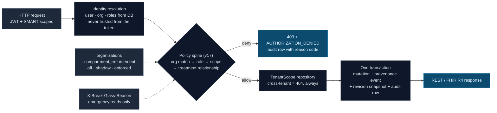

# ehr-backend


[](#what-this-is-not)
[](LICENSE)

**A clinical record backend where authorization is the feature.**

`ehr-backend` is a multi-tenant EHR core in Kotlin / Spring Boot / Postgres: a REST + FHIR R4 API over patients, encounters, conditions, allergies, observations, medications, notes, orders, and diagnostic reports — built so that **every clinical read and write passes through one deterministic policy spine and leaves audit evidence**, including the evidence of *why* it was allowed.

It runs on synthetic data only. It is **not** approved for real PHI, care delivery, prescribing, billing, or clinical decision support, and it makes **no HIPAA-compliance or ONC-certification claims** — it is a portfolio-grade implementation of the *engineering* those things require: tenancy that fails closed, minimum-necessary access, append-only audit, and full provenance.

```powershell
docker compose up -d postgres   # Postgres 16 on :54328
.\gradlew.bat bootRun           # Flyway migrates on boot
curl.exe http://localhost:8080/fhir/r4/metadata   # CapabilityStatement (public)
```



Every decision is written down. A clinician reading a chart they have no treatment relationship with, in an organization where enforcement is on:

```
$ curl -H "Authorization: Bearer $TOKEN" .../api/v1/patients/{id}/chart
HTTP/1.1 403

select operation, policy_reason_code, relationship_basis, policy_version
from audit_events where correlation_id = '...';

      operation       |     policy_reason_code     | relationship_basis | policy_version
----------------------+----------------------------+--------------------+-----------------
 AUTHORIZATION_DENIED | NO_TREATMENT_RELATIONSHIP  |                    | policy-spine-v17
```

The same read with `X-Break-Glass-Reason: "Unresponsive patient in the ED"` succeeds — and is audited with `purpose_of_use = ETREAT`, `relationship_basis = break-glass`, and the reason in audit metadata. Break-glass never bypasses tenancy, roles, or scopes; only the relationship requirement, and only for reads.

**See also:** [compartment-authorization design](docs/architecture/compartment-authorization.md) · [threat model](docs/operations/threat-model.md) · [runbook](docs/operations/runbook.md) · [Inferno (g)(10) gap analysis](docs/conformance/inferno-g10.md)

## Why

Most EHR-shaped demos are CRUD with a login. The hard part of clinical software is everything around the CRUD: who may see which patient's record, how you prove every access after the fact, and how you change the answer to "who may see what" without a breaking flag-day. This codebase is about that part:

- **One policy spine, not N copies.** Every endpoint asks the same `PolicyEvaluator`: organization match → role → SMART scope (v1 and v2, `user/`/`system/` context, patient-context fails closed) → treatment relationship. Each policy change bumps a `policy-spine-vN` version that is stamped onto every audit row, so historical decisions stay interpretable.
- **Patient-compartment authorization with a shadow-first rollout.** Care-team relationships are hybrid: explicit membership plus automatic membership when a clinician opens an encounter. Enforcement is per-organization — `off | shadow | enforced` — and `shadow` records what enforcement *would* do (`relationship_basis` on every clinical audit row) before any org turns denial on. Encounter-derived relationships auto-expire 30 days (configurable) after the encounter ends.
- **Tenancy that fails closed.** Every clinical table carries `(organization_id, patient_id)` with composite foreign keys to the patient registry; every repository read takes a `TenantScope`; a cross-tenant id is a 404, never a 403, never a row.
- **Append-only evidence.** `audit_events` is protected by database triggers — not application discipline. Clinical writes are transactional with provenance events and JSONB prior-state revision snapshots, so "amended" and "entered-in-error" have real history behind them.
- **FHIR as a boundary, not a framework.** HAPI FHIR is used as a structures library only. Nine R4 resource types are served read-only with searchset bundles and a registry-driven CapabilityStatement; responses are validated in tests against the core spec. Clinical concepts are coded terminology end to end — never display strings.

## API surface

| Surface | What it serves |
|---|---|
| `/api/v1/**` | Operational REST API: patient registry, encounters, problem list, allergies, observations, medications, notes (amend/error workflows), orders → results, patient chart, care-team management, OAuth client registration, bulk export jobs |
| `/fhir/r4/**` | Read-only FHIR R4: `Patient`, `Encounter`, `Condition`, `AllergyIntolerance`, `Observation`, `MedicationStatement`, `DocumentReference`, `DiagnosticReport`, `Provenance` + public `metadata` CapabilityStatement |
| Bulk export | Async NDJSON export jobs (FHIR Bulk Data shape) with background processing and per-job audit |

## The authorization model

| Layer | Question | Denial evidence |
|---|---|---|
| Tenancy | Is this row in your organization? | 404 (existence is never confirmed cross-tenant) |
| Role | May a `STAFF`/`CLINICIAN`/`ORG_ADMIN` do this at all? | `INSUFFICIENT_ROLE` |
| SMART scope | Does the token cover this FHIR resource + direction? | `INSUFFICIENT_SCOPE` |
| Compartment | Do you have a treatment relationship with this patient? | `NO_TREATMENT_RELATIONSHIP` |

Compartment enforcement is a per-organization posture, designed to roll out without breaking anyone:

| Mode | Behavior |
|---|---|
| `off` | Relationships not evaluated |
| `shadow` *(default)* | Relationship resolved and recorded on every clinical audit row; nothing denied — produces the data to verify the model before it can hurt anyone |
| `enforced` | Clinical reads/writes without a relationship are denied; break-glass (mandatory reason, `ETREAT`) rescues emergency **reads** only — the write path is opening an encounter, which *establishes* the relationship |

Patient demographics and encounter scheduling stay org-wide by design (registration precedes relationships); the clinical record is what compartments protect.

## Tests

```powershell
.\gradlew.bat test    # 342 tests; Testcontainers needs Docker
```

The suite is integration-first: real Postgres via Testcontainers, MockMvc against the full security filter chain, audit rows asserted by correlation id, FHIR responses validated against the R4 core spec, and adversarial cases throughout — cross-tenant probes, stale-version conflicts, double state transitions, denied-access audit trails, break-glass without a reason.

## What this is not

- **Not for real PHI.** Synthetic data only; there is no runtime mode that implies otherwise.
- **Not HIPAA-compliant or ONC-certified**, and it does not claim to be. The design borrows the right *shapes* — FHIR compartments, HL7 `PurposeOfUse`, minimum-necessary — and is explicit about what is missing.
- **No authorization server yet.** Requests authenticate with locally signed dev JWTs; identity is always resolved from the database, never trusted from the token. SMART launch flows and the resulting [Inferno (g)(10) gaps](docs/conformance/inferno-g10.md) are documented, not hand-waved.
- **No clinical intelligence.** Nothing in this system generates clinical advice, summaries, or diagnoses.

Engineering history lives in the repo: the accepted [design documents](docs/architecture/) and per-slice [implementation plans](docs/superpowers/plans/) record every decision, including the ones decided against.

## License

MIT © Conal Hickey
